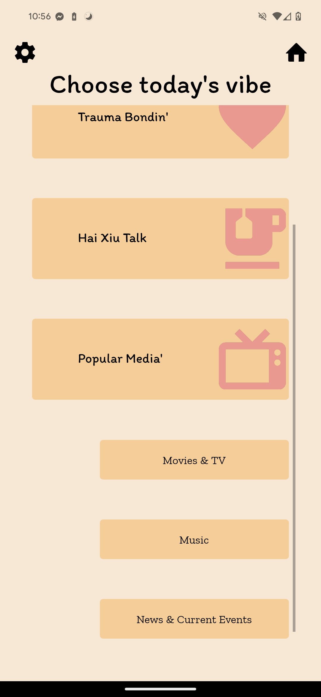

## Youzi: Social Mandarin Learning with Daily Prompts
This is a 2024 capstone project created for the Berkeley Master in Information Management and Systems program.

This app aims to make the process of (re)learning Mandarin more engaging for American-born Chinese (ABC's) and other Mandarin heritage speakers.
It does not intend to help a new speaker pick up the language, but rather provide an environment for already somewhat fluent, second-language speakers to find daily practice -- learning novel and contemporary content.

Google Play Store: Coming soon™️  
Apple App Store: Distant future :(  

## Social Media
[ TikTok][1]  
[ Instagram][2]  

## Members
Here are our members, their LinkedIn's, and roles:
- [Joanne Jun](https://www.linkedin.com/in/jun-j/) (UX Designer)
- [Victor Kuan](https://www.linkedin.com/in/vkuan/) (Product Marketing, Data Engineer, Prompt Engineer)
- [Jo Lu](https://www.linkedin.com/in/jovan-lu/) (Product Manager)
- [Harris Wang](https://www.linkedin.com/in/harriswangchunyin/) (UX Designer)
- [Tyler Wu](https://www.linkedin.com/in/tyler-wu/) (Full-stack Developer)

[1]: https://www.tiktok.com/@youzichinese
[2]: https://www.instagram.com/tinykelv/
